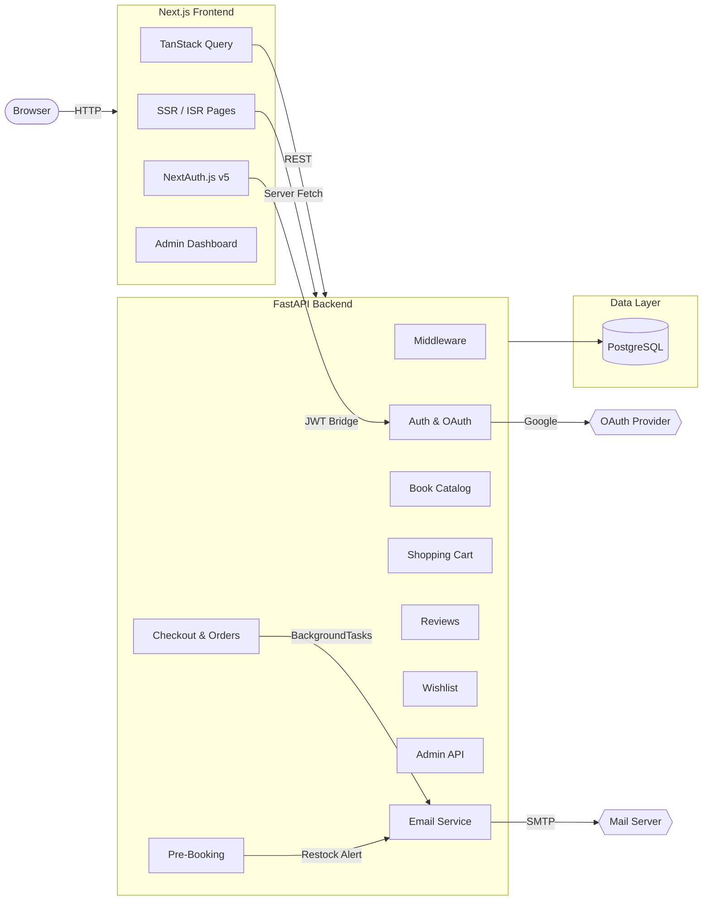
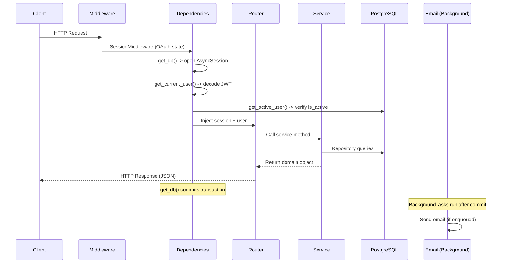
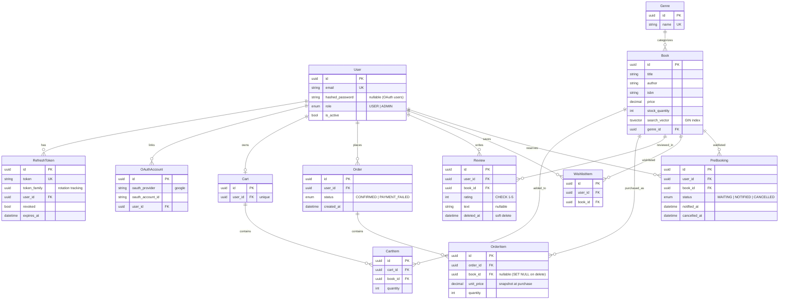

# BookStore

A full-stack online bookstore with a **FastAPI** backend and **Next.js** customer-facing storefront. Users can browse an SEO-optimized catalog, search and filter books, sign in with email or Google OAuth, manage a shopping cart with optimistic updates, checkout, review order history, maintain wishlists, pre-book out-of-stock titles, and leave verified-purchase reviews with star ratings. Admins get a separate dashboard with sales analytics, inventory alerts, catalog management, user management, and review moderation.

Monorepo structure: `backend/` (Python/FastAPI) and `frontend/` (Next.js/TypeScript).

## Table of Contents

- [Architecture](#architecture)
- [Design principles](#design-principles)
- [Frontend](#frontend)
  - [Customer storefront](#customer-storefront)
  - [Admin dashboard](#admin-dashboard)
  - [Auth integration](#auth-integration)
- [Backend](#backend)
  - [Request lifecycle](#request-lifecycle)
  - [Authentication](#authentication)
  - [Database layer](#database-layer)
  - [Catalog and search](#catalog-and-search)
  - [Checkout](#checkout)
  - [Reviews](#reviews)
  - [Pre-booking](#pre-booking)
  - [Email](#email)
  - [Error handling](#error-handling)
- [Database schema](#database-schema)
- [API reference](#api-reference)
- [Getting started](#getting-started)
- [Tech stack](#tech-stack)
- [Project structure](#project-structure)

## Architecture



The application follows a **monorepo** layout with two independent deployables:

| Layer | Responsibility |
|-------|---------------|
| **Frontend** | Next.js App Router — SSR catalog pages, client-side interactivity, admin dashboard |
| **Backend Router** | HTTP concerns — request parsing, response serialization, status codes |
| **Backend Service** | Business rules — checkout orchestration, pre-booking logic, auth flows |
| **Backend Repository** | Data access — SQL queries, eager loading, bulk operations |
| **Core** | Cross-cutting — config, JWT/password utilities, dependency injection, exceptions |

## Design principles

**Async throughout** — Every I/O operation is non-blocking. FastAPI routes are async, SQLAlchemy uses `asyncpg`, and CPU-intensive work like Argon2 password hashing runs in a thread pool via `asyncio.to_thread()`.

**Validate at the boundary, trust internally** — Pydantic validates all incoming request data at the API boundary. Once past the router layer, services and repositories trust the data they receive. Database-level constraints serve as a safety net, not the primary validation path.

**Fail safely and explicitly** — All errors are structured `AppError` exceptions with a status code, human-readable detail, and machine-readable code. Internal errors never leak stack traces. Timing-safe comparisons prevent information leakage during login.

**Minimize round-trips** — Eager loading with `selectinload()` prevents N+1 query problems. The JWT access token carries the user's role, so most requests don't need a DB lookup for authorization.

**Let PostgreSQL do what it's good at** — Full-text search uses native `tsvector`/`tsquery` with GIN indexes. `SELECT FOR UPDATE` with sorted keys prevents deadlocks during checkout. `ON CONFLICT DO NOTHING` handles race conditions in cart creation.

**Optimistic UI** — Cart and wishlist mutations update the UI immediately via TanStack Query's optimistic updates, rolling back automatically on server error.

## Frontend

### Customer storefront

The customer-facing storefront is a Next.js 15 application using the App Router with a `(store)` route group:

- **Catalog** (`/catalog`) — SSR-rendered book grid with URL-persisted search, genre filter, and pagination. Each book card shows title, author, price, stock status, and a wishlist heart toggle.
- **Book detail** (`/books/[id]`) — ISR page with JSON-LD structured data, Open Graph meta tags, breadcrumb navigation, rating display, review section, and action buttons (add to cart, wishlist, pre-book).
- **Cart** (`/cart`) — Shopping cart with quantity steppers, optimistic updates, price totals, and a checkout dialog with order confirmation.
- **Orders** (`/orders`) — Order history list with expandable order detail showing price-at-purchase snapshots.
- **Wishlist** (`/wishlist`) — Wishlist with instant heart toggle and pre-booking for out-of-stock titles.
- **Account** (`/account`) — Account hub with navigation to orders, wishlist, and active pre-bookings.
- **Auth** (`/login`, `/register`) — Email/password and Google OAuth sign-in forms.

### Admin dashboard

The admin dashboard lives under `/admin` with its own sidebar layout, separate from the customer storefront:

- **Overview** (`/admin/overview`) — KPI cards for revenue, order count, and AOV with period selector (Today/This Week/This Month) and color-coded delta badges. Low-stock count card linking to inventory. Top-5 best-sellers mini-table.
- **Sales Analytics** (`/admin/sales`) — Revenue comparison bar chart (current vs prior period), summary stats, and top-sellers table with revenue/volume toggle and configurable row limits (5/10/25).
- **Inventory Alerts** (`/admin/inventory`) — Books sorted by stock ascending with red (out-of-stock) and amber (low-stock) badges. Configurable threshold with debounced input. Stock update modal.
- **Catalog Management** (`/admin/catalog`) — *(in progress)* Paginated catalog table with search/filter, add/edit/delete book forms, stock update modal.
- **User Management** (`/admin/users`) — *(in progress)* Paginated user table with role/active filtering, deactivate/reactivate actions.
- **Review Moderation** (`/admin/reviews`) — *(in progress)* Paginated review table with filters, sort by date/rating, single and bulk delete.

Admin routes are protected with defense-in-depth: both `proxy.ts` (UX redirect) and the admin layout Server Component (security boundary) independently verify the admin role.

### Auth integration

NextAuth.js v5 handles frontend authentication with two providers:

- **Credentials** — Email/password login against the FastAPI `/auth/login` endpoint
- **Google OAuth** — Google sign-in via OpenID Connect

The frontend stores an encrypted session cookie. The FastAPI JWT access token is embedded in the NextAuth session and passed as a Bearer token on all API requests. Token refresh is handled transparently.

## Backend

### Request lifecycle



The database transaction commits *before* any background tasks run. An email confirmation is never sent for an order that failed to save.

**Dependency injection chain:**

```python
# No DB lookup - just decodes the JWT
CurrentUser = Annotated[dict, Depends(get_current_user)]

# Decodes JWT + verifies user is still active (1 DB round-trip)
ActiveUser = Annotated[dict, Depends(get_active_user)]

# Decodes JWT + checks role == "admin"
AdminUser = Annotated[dict, Depends(require_admin)]
```

### Authentication

**JWT access tokens** — HS256-signed, 15-minute TTL. Payload contains `sub` (user ID), `role`, `jti`, `iat`, and `exp`. The role is embedded so authorization checks don't require a database lookup.

**Refresh token rotation** — Opaque 512-bit strings with 7-day TTL. Every refresh issues a new token and revokes the old one. Tokens share a `token_family` UUID; if a revoked token is replayed (theft detected), the entire family is revoked.

**Google OAuth** — OpenID Connect via Authlib. User info comes from the token response. If a user with the same email exists, the OAuth account is linked to the existing user.

**Timing-safe login** — When a nonexistent email is used, a dummy Argon2 hash is verified to keep response time constant, preventing email enumeration.

### Database layer

The database session is managed as a FastAPI dependency — each request gets its own `AsyncSession`, committed on success, rolled back on exception. `expire_on_commit=False` prevents `MissingGreenlet` errors in async context.

Connection pool: 5 connections, 10 overflow, pre-ping health check, 30-minute recycle.

### Catalog and search

Full-text search uses PostgreSQL `tsvector`/`tsquery` with a GIN index on title and author. Search terms get `:*` prefix matching (e.g., "tolk" matches "tolkien"). When search is active, results sort by `ts_rank()` relevance.

Filters combine with AND semantics: search query, genre, and case-insensitive author substring. Sort options: title, price, publish date, created_at.

### Checkout

**Stock locking** — `SELECT FOR UPDATE` on all books in the cart, locked in ascending ID order to prevent deadlocks. All stock is validated before any mutation; if any book has insufficient stock, the entire checkout fails atomically.

**Price snapshots** — Each `OrderItem` stores `unit_price` captured at purchase time. The book's `price` column is the current price; the order item preserves the historical price.

**Mock payment** — 90% success rate simulation with a `force_payment_failure` flag for testing.

### Reviews

- Purchase verification enforced (checks orders table for a confirmed order)
- One review per user per book (409 with `existing_review_id` on duplicate)
- Rating-only reviews supported (text is optional)
- Soft deletes via `deleted_at` timestamp (owner or admin can delete)
- `avg_rating` and `review_count` computed live from SQL aggregates

### Pre-booking

Users can waitlist out-of-stock books. When an admin restocks from 0, all `WAITING` pre-bookings are atomically updated to `NOTIFIED` via a single `UPDATE ... RETURNING` statement, and restock alert emails are enqueued.

### Email

Emails are sent via `BackgroundTasks` (post-commit guarantee). Templates use Jinja2 HTML with auto-generated plain-text fallbacks. Two templates: `order_confirmation.html` and `restock_alert.html`. Failed sends are logged but never crash the request.

### Error handling

All errors are `AppError` exceptions with `status_code`, `detail`, `code`, and optional `field`. Exception handlers are registered in precedence order:

1. `DuplicateReviewError` -> 409 with `existing_review_id`
2. `AppError` -> structured JSON
3. `HTTPException` -> standard FastAPI errors
4. `RequestValidationError` -> 422 with Pydantic details
5. `Exception` -> 500 generic (real error logged server-side)

## Database schema



## API reference

### Auth
| Method | Path | Auth | Description |
|--------|------|------|-------------|
| POST | `/auth/register` | -- | Register with email/password |
| POST | `/auth/login` | -- | Login, returns access + refresh token |
| POST | `/auth/refresh` | -- | Rotate refresh token |
| POST | `/auth/logout` | Token | Revoke refresh token |
| GET | `/auth/google` | -- | Redirect to Google consent screen |
| GET | `/auth/google/callback` | OAuth | Handle Google OIDC callback |

### Books & Genres
| Method | Path | Auth | Description |
|--------|------|------|-------------|
| GET | `/books` | -- | Browse, search, filter, paginate catalog |
| GET | `/books/{id}` | -- | Book detail with rating aggregates |
| POST | `/books` | Admin | Create book |
| PUT | `/books/{id}` | Admin | Update book |
| DELETE | `/books/{id}` | Admin | Delete book |
| PATCH | `/books/{id}/stock` | Admin | Update stock (triggers restock alerts) |
| GET | `/genres` | -- | List all genres (alphabetical) |
| POST | `/genres` | Admin | Create genre |

### Cart & Checkout
| Method | Path | Auth | Description |
|--------|------|------|-------------|
| GET | `/cart` | User | View cart with book details |
| POST | `/cart/items` | User | Add book to cart |
| PUT | `/cart/items/{id}` | User | Update item quantity |
| DELETE | `/cart/items/{id}` | User | Remove item from cart |
| POST | `/orders/checkout` | User | Checkout with pessimistic stock locking |
| GET | `/orders` | User | List order history |
| GET | `/orders/{id}` | User | Order detail with price snapshots |

### Reviews
| Method | Path | Auth | Description |
|--------|------|------|-------------|
| POST | `/books/{id}/reviews` | User | Create review (must have purchased) |
| GET | `/books/{id}/reviews` | -- | List reviews (paginated) |
| GET | `/reviews/{id}` | -- | Single review |
| PATCH | `/reviews/{id}` | Owner | Update rating/text |
| DELETE | `/reviews/{id}` | Owner/Admin | Soft-delete review |

### Wishlist
| Method | Path | Auth | Description |
|--------|------|------|-------------|
| POST | `/wishlist` | User | Add book to wishlist |
| GET | `/wishlist` | User | View wishlist with current prices |
| DELETE | `/wishlist/{book_id}` | User | Remove from wishlist |

### Pre-Booking
| Method | Path | Auth | Description |
|--------|------|------|-------------|
| POST | `/prebooks` | User | Pre-book an out-of-stock title |
| GET | `/prebooks` | User | View pre-bookings |
| DELETE | `/prebooks/{id}` | User | Cancel pre-booking |

### Admin
| Method | Path | Auth | Description |
|--------|------|------|-------------|
| GET | `/admin/users` | Admin | List users (paginated, filterable by role/active) |
| PATCH | `/admin/users/{id}/deactivate` | Admin | Deactivate user (revokes all tokens) |
| PATCH | `/admin/users/{id}/reactivate` | Admin | Reactivate user |
| GET | `/admin/orders` | Admin | List all orders |
| GET | `/admin/sales/summary` | Admin | Revenue summary with period comparison |
| GET | `/admin/sales/top-books` | Admin | Top-selling books by revenue or volume |
| GET | `/admin/inventory/low-stock` | Admin | Books below stock threshold |
| GET | `/admin/reviews` | Admin | List all reviews (paginated, filterable) |
| DELETE | `/admin/reviews/bulk` | Admin | Bulk-delete reviews by ID list |

### Health
| Method | Path | Auth | Description |
|--------|------|------|-------------|
| GET | `/health` | -- | Application health check |

## Getting started

### Prerequisites

- Python 3.13+
- Node.js 20+
- PostgreSQL 17
- Poetry (Python)
- Docker (for database containers)

### Backend setup

```bash
cd backend

# Install dependencies
poetry install

# Copy environment file and configure
cp .env.example .env
# Edit .env with your database URL, secret key, OAuth credentials, etc.

# Start database containers
docker compose up -d
# This starts two PostgreSQL instances:
#   bookstore_dev  (port 5434) - development database with persistent volume
#   bookstore_test (port 5433) - test database (ephemeral, no volume)

# Run database migrations
poetry run task migrate

# Start the development server
poetry run task dev
```

The API will be available at `http://localhost:8000` with interactive Swagger docs at `/docs`.

### Frontend setup

```bash
cd frontend

# Install dependencies
npm install

# Generate TypeScript types from the backend OpenAPI spec
# (requires the backend to be running)
npm run generate-types

# Start the development server
npm run dev
```

The storefront will be available at `http://localhost:3000`.

### Available tasks

**Backend** (from `backend/`):

```bash
poetry run task dev              # Start uvicorn with hot reload
poetry run task test             # Run test suite (pytest)
poetry run task migrate          # Apply database migrations (alembic upgrade head)
poetry run task makemigration    # Generate new migration from model changes
poetry run task lint             # Check code style (ruff)
poetry run task format           # Auto-format code (ruff)
```

**Frontend** (from `frontend/`):

```bash
npm run dev                      # Start Next.js dev server with hot reload
npm run build                    # Production build
npm run lint                     # ESLint check
npm run generate-types           # Regenerate API types from OpenAPI spec
```

### Running tests

```bash
cd backend
poetry run task test
```

Tests use a separate PostgreSQL instance (`bookstore_test`). Tables are created and dropped per test session. Each test function gets its own database session that is rolled back after the test, so tests are fully isolated. Email sending is suppressed by default (`MAIL_SUPPRESS_SEND=1`).

## Tech stack

| Layer | Technology |
|-------|-----------|
| **Frontend** | |
| Framework | Next.js 16 (App Router, SSR/ISR) |
| Language | TypeScript |
| State | TanStack Query v5 |
| UI Components | shadcn/ui + Radix UI |
| Styling | Tailwind CSS v4 |
| Auth | NextAuth.js v5 |
| Charts | Recharts |
| API Types | openapi-typescript (auto-generated from FastAPI spec) |
| **Backend** | |
| Framework | FastAPI |
| ORM | SQLAlchemy 2.0 (async) |
| Database | PostgreSQL 17 |
| Async Driver | asyncpg |
| Migrations | Alembic |
| Auth | JWT (PyJWT, HS256) + Argon2 (pwdlib) |
| OAuth | Authlib (Google OIDC) |
| Email | fastapi-mail + Jinja2 |
| Validation | Pydantic v2 |
| Config | pydantic-settings (.env) |
| Testing | pytest + pytest-asyncio + httpx |
| Linting | Ruff |
| Package Manager | Poetry |
| Containers | Docker Compose |

## Project structure

```
bookstore/
├── backend/
│   ├── app/
│   │   ├── main.py              # App factory, middleware, exception handlers
│   │   ├── core/
│   │   │   ├── config.py        # Pydantic Settings (env-based, cached)
│   │   │   ├── security.py      # JWT encode/decode, Argon2 hash/verify
│   │   │   ├── deps.py          # Dependency injection (DbSession, CurrentUser, etc.)
│   │   │   ├── exceptions.py    # AppError, DuplicateReviewError, handlers
│   │   │   ├── oauth.py         # Authlib OAuth registry (Google)
│   │   │   └── health.py        # Health check endpoint
│   │   ├── db/
│   │   │   ├── base.py          # DeclarativeBase for all models
│   │   │   └── session.py       # Async engine, session factory, pool config
│   │   ├── users/               # Auth, registration, refresh tokens, OAuth
│   │   ├── books/               # Catalog CRUD, genres, full-text search
│   │   ├── cart/                # Per-user shopping cart
│   │   ├── orders/              # Checkout orchestration, order history
│   │   ├── reviews/             # Verified-purchase reviews, soft-delete, aggregates
│   │   ├── wishlist/            # Personal wishlists
│   │   ├── prebooks/            # Pre-booking with restock notifications
│   │   ├── admin/               # User management, sales analytics, review moderation
│   │   └── email/               # Email service, Jinja2 templates, background sending
│   ├── alembic/                 # Database migration scripts
│   ├── tests/                   # Async test suite (pytest)
│   ├── docker-compose.yml       # PostgreSQL containers (dev + test)
│   ├── pyproject.toml           # Poetry dependencies and task definitions
│   └── .env.example             # Environment variable template
├── frontend/
│   ├── src/
│   │   ├── app/
│   │   │   ├── (auth)/          # Login and register pages
│   │   │   ├── (store)/         # Customer storefront (catalog, cart, orders, etc.)
│   │   │   ├── admin/           # Admin dashboard (overview, sales, inventory, etc.)
│   │   │   └── layout.tsx       # Root layout (providers shell)
│   │   ├── components/
│   │   │   ├── admin/           # Admin-specific components (sidebar, charts)
│   │   │   ├── auth/            # Auth forms (login, register, Google button)
│   │   │   ├── layout/          # Header, footer, cart badge, navigation
│   │   │   └── ui/              # shadcn/ui primitives
│   │   ├── lib/
│   │   │   ├── api.ts           # Authenticated fetch wrapper
│   │   │   ├── admin.ts         # Admin API functions and TanStack Query keys
│   │   │   └── utils.ts         # Shared utilities
│   │   ├── types/
│   │   │   └── api.generated.ts # Auto-generated from OpenAPI spec
│   │   └── auth.ts              # NextAuth.js configuration
│   ├── package.json
│   └── tsconfig.json
└── README.md
```
