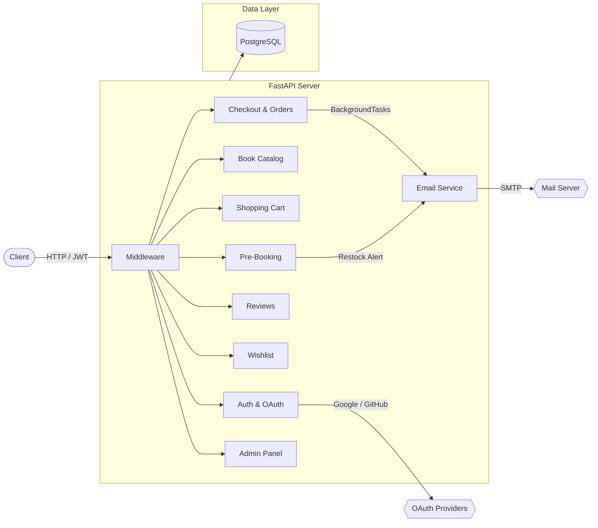
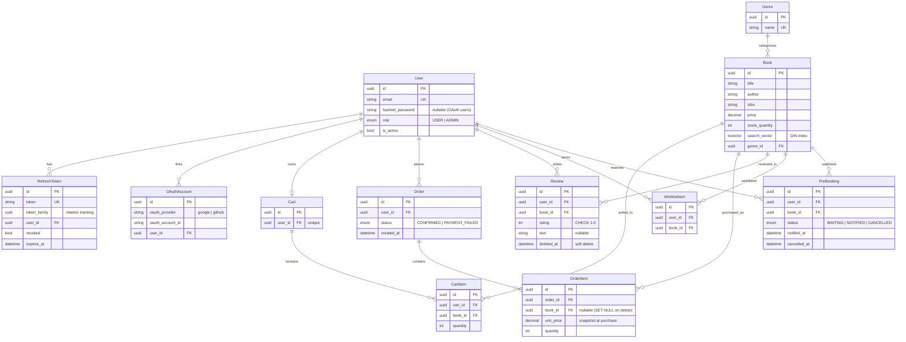

# BookStore API

An online bookstore API where administrators manage a catalog of books (with details, pricing, and stock) and users can browse, search, purchase books through a cart/checkout flow, maintain wishlists, pre-book out-of-stock titles, leave verified-purchase reviews with ratings, and receive transactional emails. Built with FastAPI, PostgreSQL, SQLAlchemy (async), and managed with Poetry.

## Table of Contents

- [Design principles](#design-principles)
- [Overview](#overview)
- [Request lifecycle](#request-lifecycle)
- [Notes about authentication](#notes-about-authentication)
  - [JWT access tokens](#jwt-access-tokens)
  - [Refresh token rotation](#refresh-token-rotation)
  - [OAuth integration](#oauth-integration)
  - [Timing-safe login](#timing-safe-login)
- [Notes about the database layer](#notes-about-the-database-layer)
  - [Async session management](#async-session-management)
  - [Connection pooling](#connection-pooling)
- [Notes about the catalog](#notes-about-the-catalog)
  - [Full-text search](#full-text-search)
  - [Genre filtering and sorting](#genre-filtering-and-sorting)
- [Notes about checkout](#notes-about-checkout)
  - [Stock locking and deadlock prevention](#stock-locking-and-deadlock-prevention)
  - [Price snapshots](#price-snapshots)
  - [Mock payment service](#mock-payment-service)
- [Notes about reviews](#notes-about-reviews)
  - [Purchase verification](#purchase-verification)
  - [Soft deletes](#soft-deletes)
  - [Rating aggregates](#rating-aggregates)
- [Notes about pre-booking](#notes-about-pre-booking)
  - [Restock notifications](#restock-notifications)
- [Notes about email](#notes-about-email)
  - [Post-commit safety](#post-commit-safety)
  - [Template rendering](#template-rendering)
- [Error handling](#error-handling)
- [Database schema](#database-schema)
- [API reference](#api-reference)
- [Getting started](#getting-started)
- [Project structure](#project-structure)

## Design principles

**Async throughout**

Every I/O operation is non-blocking. FastAPI routes are async, SQLAlchemy uses the async driver `asyncpg`, and CPU-intensive work like Argon2 password hashing runs in a thread pool via `asyncio.to_thread()` to avoid blocking the event loop. This means the server can handle many concurrent requests on a single process.

**Validate at the boundary, trust internally**

Pydantic validates all incoming request data at the API boundary. Once past the router layer, services and repositories trust the data they receive. Database-level constraints (CHECK, UNIQUE, FOREIGN KEY) serve as a safety net, not the primary validation path.

**Fail safely and explicitly**

All errors are represented as structured `AppError` exceptions with a status code, human-readable detail, and a machine-readable code. Internal errors never leak stack traces. Emails that fail to send are logged and dropped silently — they never crash a request. Timing-safe comparisons prevent information leakage during login.

**Minimize round-trips**

Eager loading with `selectinload()` prevents N+1 query problems. Bulk operations like restock notifications use a single `UPDATE ... RETURNING` statement instead of loading rows one at a time. The JWT access token carries the user's role, so most requests don't need a DB lookup for authorization — only routes that check `is_active` hit the database.

**Let PostgreSQL do what it's good at**

Full-text search uses native `tsvector`/`tsquery` with GIN indexes instead of pulling data into Python. Unique constraints and CHECK constraints enforce invariants at the database level. `ON CONFLICT DO NOTHING` handles race conditions in cart creation. `SELECT FOR UPDATE` with sorted keys prevents deadlocks during checkout.

## Overview



The application is organized as a set of **domain modules**, each with its own models, schemas, repository, service (when business logic warrants it), and router. All modules share a common core that provides configuration, security utilities, dependency injection, and error handling.

| Layer | Responsibility |
|-------|---------------|
| **Router** | HTTP concerns — request parsing, response serialization, status codes |
| **Service** | Business rules — checkout orchestration, pre-booking logic, auth flows |
| **Repository** | Data access — SQL queries, eager loading, bulk operations |
| **Core** | Cross-cutting — config, JWT/password utilities, dependency injection, exceptions |

Each domain module lives in its own directory under `app/`:

```
app/
├── main.py              # App factory, middleware, exception handlers, router registration
├── core/                # Config, security, dependencies, exceptions, OAuth
├── db/                  # Async engine, session factory, declarative base
├── users/               # Registration, login, refresh tokens, OAuth callbacks
├── books/               # Catalog CRUD, genres, full-text search
├── cart/                # Per-user cart with item management
├── orders/              # Checkout orchestration, order history
├── reviews/             # Verified-purchase reviews with ratings
├── wishlist/            # Personal wishlists
├── prebooks/            # Pre-booking for out-of-stock titles
├── admin/               # User management (list, deactivate, reactivate)
└── email/               # Jinja2 templates, fastapi-mail, background sending
```

## Request lifecycle

Every request follows this path through the application:


The key guarantee here is **ordering**: the database transaction commits *before* any background tasks run. This means an email confirmation is never sent for an order that failed to save. This is a structural property of how FastAPI's dependency injection works with `BackgroundTasks`, not something enforced by manual coordination.

**Dependency injection chain:**

```python
# No DB lookup — just decodes the JWT
CurrentUser = Annotated[dict, Depends(get_current_user)]

# Decodes JWT + verifies user is still active (1 DB round-trip)
ActiveUser = Annotated[dict, Depends(get_active_user)]

# Decodes JWT + checks role == "admin"
AdminUser = Annotated[dict, Depends(require_admin)]
```

The `ActiveUser` dependency adds one database query per request. This is intentional — it ensures that a deactivated user is locked out immediately, even if their JWT hasn't expired yet.

## Notes about authentication

### JWT access tokens

Access tokens are signed with HS256 and have a 15-minute TTL. The payload contains `sub` (user ID), `role`, `jti` (unique token ID), `iat`, and `exp`. The role is embedded in the token so authorization checks don't require a database lookup.

```python
# Token creation (synchronous — HS256 is fast)
payload = {
    "sub": str(user_id),
    "role": role,
    "jti": str(uuid.uuid4()),
    "iat": now,
    "exp": now + timedelta(minutes=15),
}
return jwt.encode(payload, SECRET_KEY, algorithm="HS256")
```

### Refresh token rotation

Refresh tokens are opaque 512-bit strings (not JWTs). They have a 7-day TTL. Every time a refresh token is used, a new one is issued and the old one is revoked. This is called **rotation**.

Tokens belong to a **family** — all tokens issued from the same login session share a `token_family` UUID. If a revoked token is ever presented (indicating it was stolen and the legitimate user already rotated it), the entire family is revoked, logging the user out of all devices in that session.

```
Login → token_A (family: abc-123)
Refresh token_A → token_B (family: abc-123), token_A revoked
Refresh token_B → token_C (family: abc-123), token_B revoked

If attacker replays token_A:
  → token_A is already revoked
  → revoke ALL tokens in family abc-123
  → attacker and legitimate user both logged out
```

### OAuth integration

Two OAuth providers are supported: Google (OpenID Connect) and GitHub (OAuth2).

Google uses OIDC, so user info comes directly from the token response — no additional API call needed. GitHub doesn't support OIDC, so after obtaining the access token, a separate call to `GET /user` and potentially `GET /user/emails` is needed to get the user's email (which may be private).

OAuth accounts are stored in a separate `OAuthAccount` table linked to the user. If a user with the same email already exists (from email/password registration), the OAuth account is linked to the existing user rather than creating a duplicate.

### Timing-safe login

When a user attempts to log in with an email that doesn't exist, the server still runs a password hash verification against a dummy hash. This ensures the response time is constant regardless of whether the email exists, preventing timing-based enumeration attacks.

```python
DUMMY_HASH = "$argon2id$v=19$m=65536,t=3,p=4$..."  # Pre-computed dummy

user = await repo.get_by_email(email)
if user is None:
    await verify_password(password, DUMMY_HASH)  # Constant time
    raise AppError(401, "Invalid credentials", "AUTH_INVALID_CREDENTIALS")
```

## Notes about the database layer

### Async session management

The database session is managed as a FastAPI dependency. Each request gets its own `AsyncSession`. On success, the session is committed; on exception, it's rolled back.

```python
async def get_db() -> AsyncGenerator[AsyncSession]:
    async with AsyncSessionLocal() as session:
        try:
            yield session
            await session.commit()
        except Exception:
            await session.rollback()
            raise
        finally:
            await session.close()
```

A critical configuration is `expire_on_commit=False` on the session factory. Without this, accessing any attribute on a model after commit would trigger a synchronous refresh, which raises `MissingGreenlet` in an async context. With this setting, committed objects retain their loaded state.

### Connection pooling

The async engine is configured with a pool of 5 connections and an overflow of 10, for a maximum of 15 concurrent connections. Connections are health-checked before use (`pool_pre_ping=True`) and recycled after 30 minutes to prevent stale connections from causing errors.

```python
engine = create_async_engine(
    DATABASE_URL,
    pool_size=5,
    max_overflow=10,
    pool_pre_ping=True,
    pool_recycle=1800,
)
```

## Notes about the catalog

### Full-text search

Book search uses PostgreSQL's native full-text search. Each book has a computed `search_vector` column (type `tsvector`) with a GIN index. The vector is built from the book's title and author.

When a search query is provided, it's converted into a `tsquery` with prefix matching. Each word gets a `:*` suffix so that partial words match (e.g., "tolk" matches "tolkien"). Multiple words are combined with `&` (AND).

```python
def _build_tsquery(q: str) -> str:
    tokens = re.split(r"\s+", q.strip())
    clean = [re.sub(r"[^\w-]", "", t, flags=re.UNICODE) for t in tokens if t]
    prefix_tokens = [f"{t}:*" for t in clean if t]
    return " & ".join(prefix_tokens)

# "lord rings"  →  "lord:* & rings:*"
# "tolkien"     →  "tolkien:*"
```

When a search query is active, results are sorted by `ts_rank()` (relevance) instead of the user-specified sort order. This ensures the most relevant results appear first. The book's `id` is used as a tiebreaker for stable pagination.

### Genre filtering and sorting

Filters can be combined freely — search query, genre, and author work together with AND semantics. Author matching is case-insensitive substring (`ILIKE '%author%'`). Available sort orders are: title (A-Z), price (ascending), publish date (ascending), and created_at (newest first).

## Notes about checkout

### Stock locking and deadlock prevention

The checkout flow uses pessimistic locking to prevent overselling. When a user checks out, all books in their cart are locked with `SELECT FOR UPDATE`. This prevents any other checkout from reading or modifying the same book rows until the transaction completes.

To prevent deadlocks when two users check out overlapping sets of books simultaneously, book IDs are always locked in **ascending sorted order**:

```python
# Step 1: Sort book IDs to prevent deadlock
book_ids = sorted(item.book_id for item in cart.items)

# Step 2: Lock books in sorted order
books = await order_repo.lock_books(book_ids)  # SELECT ... FOR UPDATE

# Step 3: Validate ALL stock before any mutation
for item in cart.items:
    if book_map[item.book_id].stock_quantity < item.quantity:
        insufficient.append(...)

# Step 4: If all valid, decrement stock and create order
```

All stock is validated before any mutation happens. If any book has insufficient stock, the entire checkout fails atomically — no partial orders.

### Price snapshots

Each `OrderItem` stores a `unit_price` that is captured at the time of purchase. If a book's price changes after the order is placed, the order history still reflects what the user actually paid. The book's `price` column is the *current* price; `OrderItem.unit_price` is the *historical* price.

### Mock payment service

Payment processing uses a mock service with a 90% success rate. This simulates real-world payment failures without integrating an actual payment gateway. A `force_payment_failure` flag in the checkout request allows deterministic testing.

```python
class MockPaymentService:
    async def charge(self, force_fail: bool = False) -> bool:
        if force_fail:
            return False
        return random.random() > 0.10  # 90% success
```

## Notes about reviews

### Purchase verification

A user can only review a book they have purchased. This is enforced by checking the `orders` table for a confirmed order containing the book. Rating-only reviews are supported — the `text` field is optional.

A user can only leave one review per book. If they attempt to create a duplicate, the response is a 409 with the `existing_review_id` so the client can redirect to an edit flow.

### Soft deletes

Reviews are never hard-deleted. Instead, a `deleted_at` timestamp is set. All queries filter with `WHERE deleted_at IS NULL`. This preserves review data for analytics while hiding it from the public API. Both the review owner and admins can soft-delete a review.

### Rating aggregates

The book detail endpoint includes `avg_rating` (rounded to 1 decimal) and `review_count`, computed on the fly from the reviews table. Only non-deleted reviews are included in the aggregates.

```python
select(
    func.avg(Review.rating),
    func.count(Review.id),
).where(
    Review.book_id == book_id,
    Review.deleted_at.is_(None),
)
```

## Notes about pre-booking

Users can pre-book (waitlist) a book that is currently out of stock. The pre-booking is created with status `WAITING`. A user can only have one active pre-booking per book, enforced by a partial unique index (`WHERE status = 'waiting'`).

### Restock notifications

When an admin updates a book's stock from 0 to a positive number, all `WAITING` pre-bookings for that book are atomically updated to `NOTIFIED` in a single `UPDATE ... RETURNING` statement. The returned user IDs are used to enqueue restock alert emails.

```python
# Single bulk UPDATE — no N+1, no race conditions
result = await session.execute(
    update(PreBooking)
    .where(
        PreBooking.book_id == book_id,
        PreBooking.status == PreBookStatus.WAITING,
    )
    .values(status=PreBookStatus.NOTIFIED, notified_at=datetime.now(UTC))
    .returning(PreBooking.user_id)
)
user_ids = list(result.scalars().all())
```

## Notes about email

### Post-commit safety

Emails are sent via `BackgroundTasks`, which execute after the response is sent and after the database transaction is committed. This provides a structural guarantee: if the transaction rolls back, the email is never sent. This is not enforced by manual checks — it's a property of FastAPI's execution order.

The email service itself catches all exceptions during sending. A failed email is logged but never crashes the background task or affects the user's response.

### Template rendering

Emails use Jinja2 HTML templates with auto-generated plain-text fallbacks. The plain text is created by stripping HTML tags from the rendered template, replacing block-level closing tags with spaces to preserve readability. Emails are sent as `multipart/alternative` so the client can choose HTML or plain text.

Two templates exist: `order_confirmation.html` (sent after checkout) and `restock_alert.html` (sent when a waitlisted book is back in stock).

## Error handling

All application errors are represented as `AppError` exceptions with three fields:

| Field | Purpose |
|-------|---------|
| `status_code` | HTTP status (400, 401, 404, 409, etc.) |
| `detail` | Human-readable message |
| `code` | Machine-readable code (e.g., `AUTH_TOKEN_EXPIRED`, `ORDER_CART_EMPTY`) |
| `field` | Optional — which request field caused the error |

Exception handlers are registered in precedence order:

1. `DuplicateReviewError` → 409 with `existing_review_id`
2. `AppError` → structured JSON with status code, detail, and code
3. `HTTPException` → standard FastAPI/Starlette HTTP errors
4. `RequestValidationError` → 422 with Pydantic validation details
5. `Exception` → 500 with generic "Internal server error" (real error logged server-side)

## Database schema



## API reference

### Auth
| Method | Path | Auth | Description |
|--------|------|------|-------------|
| POST | `/auth/register` | — | Register with email/password |
| POST | `/auth/login` | — | Login, returns access + refresh token |
| POST | `/auth/refresh` | — | Rotate refresh token |
| POST | `/auth/logout` | Token | Revoke refresh token |
| GET | `/auth/google` | — | Redirect to Google consent screen |
| GET | `/auth/google/callback` | OAuth | Handle Google OIDC callback |
| GET | `/auth/github` | — | Redirect to GitHub authorization |
| GET | `/auth/github/callback` | OAuth | Handle GitHub OAuth callback |

### Books & Genres
| Method | Path | Auth | Description |
|--------|------|------|-------------|
| GET | `/books` | — | Browse, search, filter, paginate catalog |
| GET | `/books/{id}` | — | Book detail with rating aggregates |
| POST | `/books` | Admin | Create book |
| PUT | `/books/{id}` | Admin | Update book |
| DELETE | `/books/{id}` | Admin | Delete book |
| PATCH | `/books/{id}/stock` | Admin | Update stock (triggers restock alerts) |
| GET | `/genres` | — | List all genres (alphabetical) |
| POST | `/genres` | Admin | Create genre |

### Cart & Checkout
| Method | Path | Auth | Description |
|--------|------|------|-------------|
| GET | `/cart` | User | View cart with book details |
| POST | `/cart/items` | User | Add book to cart |
| PUT | `/cart/items/{id}` | User | Update item quantity |
| DELETE | `/cart/items/{id}` | User | Remove item from cart |
| POST | `/orders/checkout` | User | Checkout with pessimistic stock locking |
| GET | `/orders` | User | List order history |
| GET | `/orders/{id}` | User | Order detail with price snapshots |

### Reviews
| Method | Path | Auth | Description |
|--------|------|------|-------------|
| POST | `/books/{id}/reviews` | User | Create review (must have purchased) |
| GET | `/books/{id}/reviews` | — | List reviews (paginated) |
| GET | `/reviews/{id}` | — | Single review |
| PATCH | `/reviews/{id}` | Owner | Update rating/text |
| DELETE | `/reviews/{id}` | Owner/Admin | Soft-delete review |

### Wishlist
| Method | Path | Auth | Description |
|--------|------|------|-------------|
| POST | `/wishlist` | User | Add book to wishlist |
| GET | `/wishlist` | User | View wishlist with current prices |
| DELETE | `/wishlist/{book_id}` | User | Remove from wishlist |

### Pre-Booking
| Method | Path | Auth | Description |
|--------|------|------|-------------|
| POST | `/prebooks` | User | Pre-book an out-of-stock title |
| GET | `/prebooks` | User | View pre-bookings |
| DELETE | `/prebooks/{id}` | User | Cancel pre-booking |

### Admin
| Method | Path | Auth | Description |
|--------|------|------|-------------|
| GET | `/admin/users` | Admin | List users (paginated, filterable by role/active) |
| PATCH | `/admin/users/{id}/deactivate` | Admin | Deactivate user (revokes all tokens) |
| PATCH | `/admin/users/{id}/reactivate` | Admin | Reactivate user |
| GET | `/admin/orders` | Admin | List all orders |

### Health
| Method | Path | Auth | Description |
|--------|------|------|-------------|
| GET | `/health` | — | Application health check |

## Getting started

### Prerequisites

- Python 3.12+
- PostgreSQL 17
- Poetry
- Docker (for database containers)

### Setup

```bash
# Clone the repository
git clone https://github.com/Sushasan11/bookstore.git
cd bookstore

# Install dependencies
poetry install

# Copy environment file and configure
cp .env.example .env
# Edit .env with your database URL, secret key, OAuth credentials, etc.

# Start database containers
docker compose up -d
# This starts two PostgreSQL instances:
#   bookstore_dev  (port 5434) — development database with persistent volume
#   bookstore_test (port 5433) — test database (ephemeral, no volume)

# Run database migrations
poetry run task migrate

# Start the development server
poetry run task dev
```

The API will be available at `http://localhost:8000` with interactive Swagger docs at `/docs`.

### Available tasks

```bash
poetry run task dev              # Start uvicorn with hot reload
poetry run task test             # Run test suite (pytest)
poetry run task migrate          # Apply database migrations (alembic upgrade head)
poetry run task makemigration    # Generate new migration from model changes
poetry run task lint             # Check code style (ruff)
poetry run task format           # Auto-format code (ruff)
```

### Running tests

```bash
poetry run task test
```

Tests use a separate PostgreSQL instance (`bookstore_test`). Tables are created and dropped per test session. Each test function gets its own database session that is rolled back after the test, so tests are fully isolated. Email sending is suppressed by default (`MAIL_SUPPRESS_SEND=1`).

## Tech stack

| Layer | Technology |
|-------|-----------|
| Framework | FastAPI |
| ORM | SQLAlchemy 2.0 (async) |
| Database | PostgreSQL 17 |
| Async Driver | asyncpg |
| Migrations | Alembic |
| Auth | JWT (PyJWT, HS256) + Argon2 (pwdlib) |
| OAuth | Authlib (Google OIDC, GitHub OAuth2) |
| Email | fastapi-mail + Jinja2 |
| Validation | Pydantic v2 |
| Config | pydantic-settings (.env) |
| Testing | pytest + pytest-asyncio + httpx |
| Linting | Ruff |
| Package Manager | Poetry |
| Containers | Docker Compose |

## Project structure

```
bookstore/
├── app/
│   ├── main.py              # App factory, middleware, exception handlers
│   ├── core/
│   │   ├── config.py        # Pydantic Settings (env-based, cached)
│   │   ├── security.py      # JWT encode/decode, Argon2 hash/verify
│   │   ├── deps.py          # Dependency injection (DbSession, CurrentUser, etc.)
│   │   ├── exceptions.py    # AppError, DuplicateReviewError, handlers
│   │   ├── oauth.py         # Authlib OAuth registry (Google, GitHub)
│   │   └── health.py        # Health check endpoint
│   ├── db/
│   │   ├── base.py          # DeclarativeBase for all models
│   │   └── session.py       # Async engine, session factory, pool config
│   ├── users/               # Auth, registration, refresh tokens, OAuth
│   ├── books/               # Catalog CRUD, genres, full-text search
│   ├── cart/                # Per-user shopping cart
│   ├── orders/              # Checkout orchestration, order history
│   ├── reviews/             # Verified-purchase reviews, soft-delete, aggregates
│   ├── wishlist/            # Personal wishlists
│   ├── prebooks/            # Pre-booking with restock notifications
│   ├── admin/               # User management (list, deactivate, reactivate)
│   └── email/               # Email service, Jinja2 templates, background sending
├── alembic/                 # Database migration scripts
├── tests/                   # Async test suite (pytest)
├── docker-compose.yml       # PostgreSQL containers (dev + test)
├── pyproject.toml           # Poetry dependencies and task definitions
└── .env.example             # Environment variable template
```
