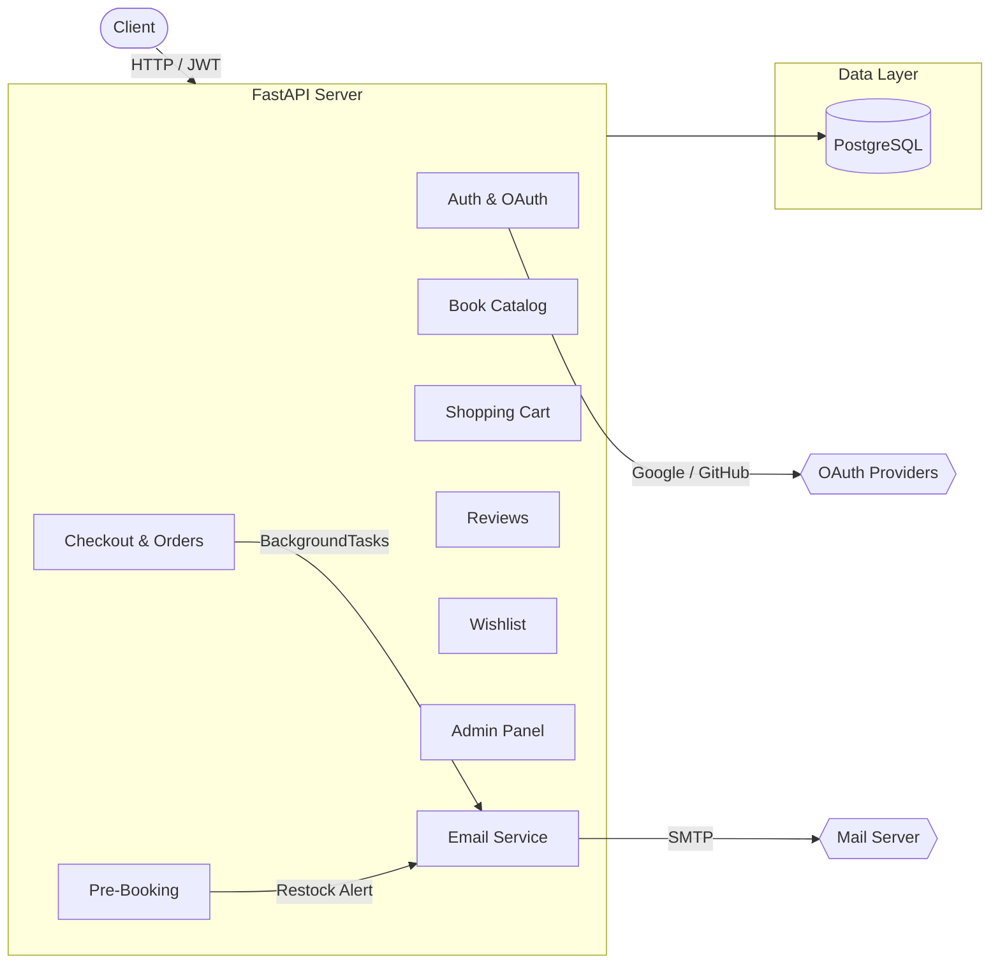
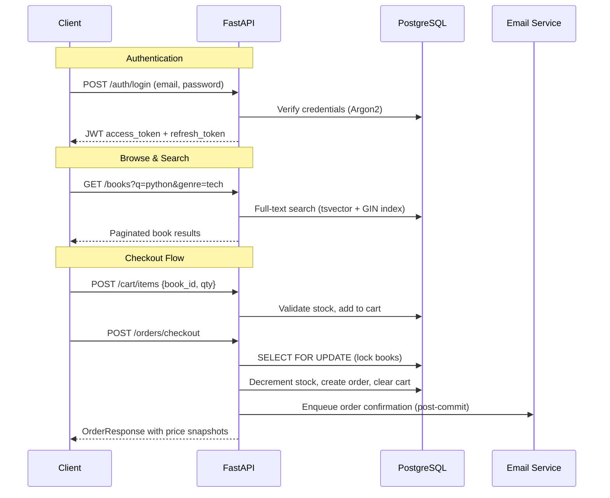
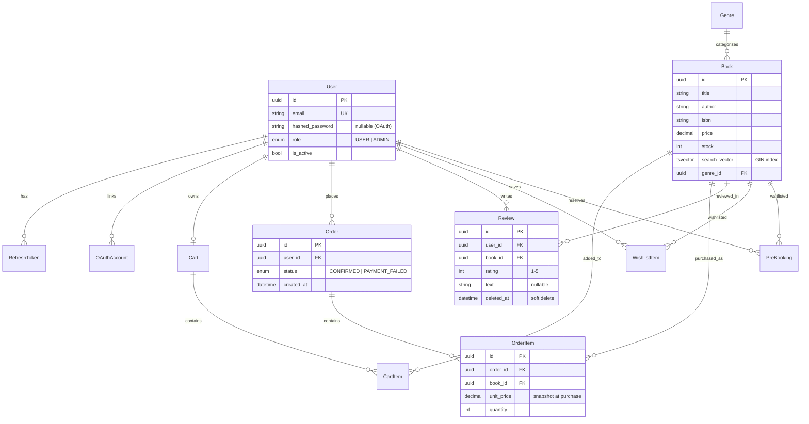

# BookStore API

A full-featured online bookstore REST API built with **FastAPI**, **PostgreSQL**, and **SQLAlchemy** (async). Users can browse, search, purchase books, maintain wishlists, leave reviews, and pre-book out-of-stock titles. Admins manage the catalog and users.

## Architecture



## Request Flow



## Database Schema



## Tech Stack

| Layer | Technology |
|-------|-----------|
| Framework | FastAPI |
| ORM | SQLAlchemy 2.0 (async) |
| Database | PostgreSQL 17 |
| Driver | asyncpg |
| Migrations | Alembic |
| Auth | JWT (HS256) + Argon2 password hashing |
| OAuth | Authlib (Google OIDC, GitHub OAuth2) |
| Email | fastapi-mail + Jinja2 templates |
| Testing | pytest + pytest-asyncio + httpx |
| Linting | Ruff |
| Package Manager | Poetry |

## API Endpoints

### Auth
| Method | Path | Auth | Description |
|--------|------|------|-------------|
| POST | `/auth/register` | - | Register with email/password |
| POST | `/auth/login` | - | Login, get tokens |
| POST | `/auth/refresh` | - | Rotate refresh token |
| POST | `/auth/logout` | Token | Revoke refresh token |
| GET | `/auth/google` | - | Google OAuth redirect |
| GET | `/auth/github` | - | GitHub OAuth redirect |

### Books & Genres
| Method | Path | Auth | Description |
|--------|------|------|-------------|
| GET | `/books` | - | Browse/search/filter catalog |
| GET | `/books/{id}` | - | Book detail with rating aggregates |
| POST | `/books` | Admin | Create book |
| PUT | `/books/{id}` | Admin | Update book |
| DELETE | `/books/{id}` | Admin | Delete book |
| PATCH | `/books/{id}/stock` | Admin | Update stock (triggers restock alerts) |
| GET | `/genres` | - | List genres |
| POST | `/genres` | Admin | Create genre |

### Cart & Checkout
| Method | Path | Auth | Description |
|--------|------|------|-------------|
| GET | `/cart` | User | View cart |
| POST | `/cart/items` | User | Add item to cart |
| PUT | `/cart/items/{id}` | User | Update quantity |
| DELETE | `/cart/items/{id}` | User | Remove item |
| POST | `/orders/checkout` | User | Checkout with stock locking |
| GET | `/orders` | User | Order history |
| GET | `/orders/{id}` | User | Order detail |

### Reviews
| Method | Path | Auth | Description |
|--------|------|------|-------------|
| POST | `/books/{id}/reviews` | User | Create review (purchase required) |
| GET | `/books/{id}/reviews` | - | List reviews |
| PATCH | `/reviews/{id}` | Owner | Update review |
| DELETE | `/reviews/{id}` | Owner/Admin | Soft-delete review |

### Wishlist & Pre-Booking
| Method | Path | Auth | Description |
|--------|------|------|-------------|
| POST | `/wishlist` | User | Add to wishlist |
| GET | `/wishlist` | User | View wishlist |
| DELETE | `/wishlist/{book_id}` | User | Remove from wishlist |
| POST | `/prebooks` | User | Pre-book out-of-stock title |
| GET | `/prebooks` | User | View pre-bookings |
| DELETE | `/prebooks/{id}` | User | Cancel pre-booking |

### Admin
| Method | Path | Auth | Description |
|--------|------|------|-------------|
| GET | `/admin/users` | Admin | List users (paginated, filterable) |
| PATCH | `/admin/users/{id}/deactivate` | Admin | Deactivate user |
| PATCH | `/admin/users/{id}/reactivate` | Admin | Reactivate user |
| GET | `/admin/orders` | Admin | List all orders |

## Key Design Decisions

- **Async throughout** — FastAPI + SQLAlchemy async + asyncpg for non-blocking I/O
- **Pessimistic locking** — `SELECT FOR UPDATE` during checkout prevents overselling
- **Price snapshots** — OrderItem stores `unit_price` at time of purchase
- **Refresh token rotation** — Token families detect and prevent token theft
- **Soft deletes** — Reviews use `deleted_at` instead of hard deletes
- **Post-commit emails** — BackgroundTasks only fire after the DB transaction commits
- **Full-text search** — PostgreSQL `tsvector` with GIN index on title + author

## Getting Started

### Prerequisites

- Python 3.12+
- PostgreSQL 17
- Poetry

### Setup

```bash
# Clone
git clone https://github.com/Sushasan11/bookstore.git
cd bookstore

# Install dependencies
poetry install

# Copy env and configure
cp .env.example .env

# Start databases
docker compose up -d

# Run migrations
poetry run task migrate

# Start dev server
poetry run task dev
```

The API will be available at `http://localhost:8000` with interactive docs at `/docs`.

### Running Tests

```bash
poetry run task test
```

## Project Structure

```
app/
├── main.py              # App factory, router registration
├── core/                # Config, security, dependencies, exceptions
├── db/                  # Database session & base model
├── users/               # Auth, registration, OAuth
├── books/               # Catalog, genres, full-text search
├── cart/                # Shopping cart
├── orders/              # Checkout, order history
├── reviews/             # Book reviews & ratings
├── wishlist/            # User wishlists
├── prebooks/            # Pre-booking / waitlist
├── admin/               # User management
└── email/               # Email service & Jinja2 templates
```
